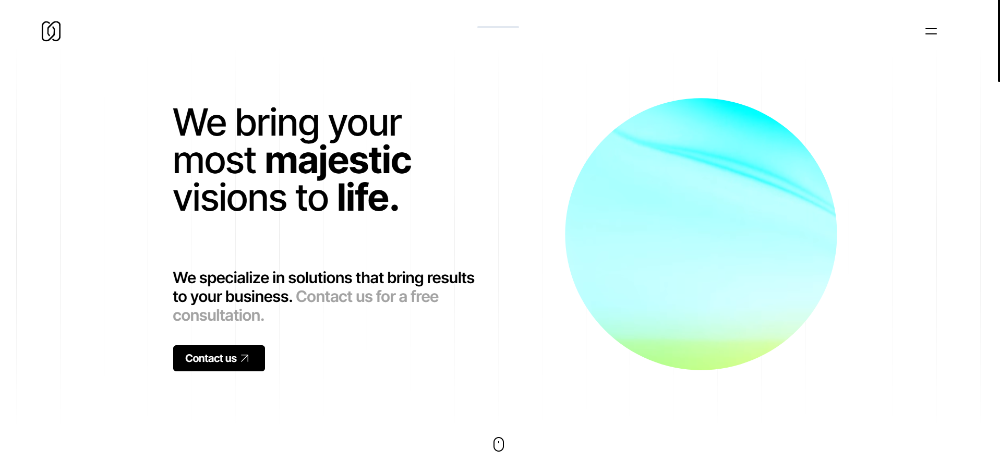

# [bybil.nu](https://bybil.nu)

Mizar is a template made with [Astro](https://astro.build) and [Tailwind](https://tailwindcss.com/).

### [🧪 Site preview →](https://bybil.nu)

### [🧑‍🚀 Astro website →](https://astro.build/)

### [🕮 Astro docs →](https://docs.astro.build/en/getting-started/)

---

## Preview

## 🧪 Test

On the folder run

1. `bun install`  <small>(or `yarn` or `pnpm i`)</small>
2. `bun run dev`  <small>(or `yarn dev` or `pnpm dev`)</small>

## ✅ Features

- [x] Localization
- [x] PWA (thanks to vite-pwa)

---

<a href="https://majestico.co" target="_blank">majestico.co

